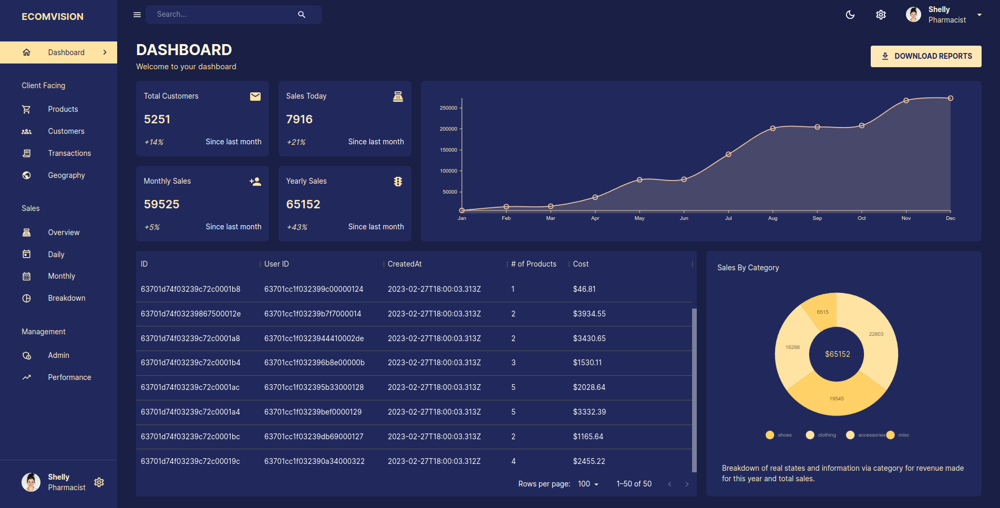
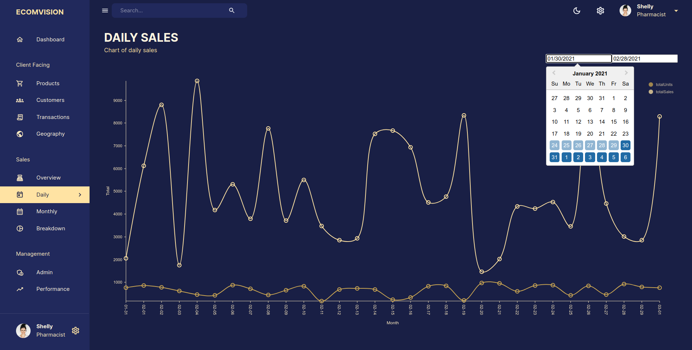
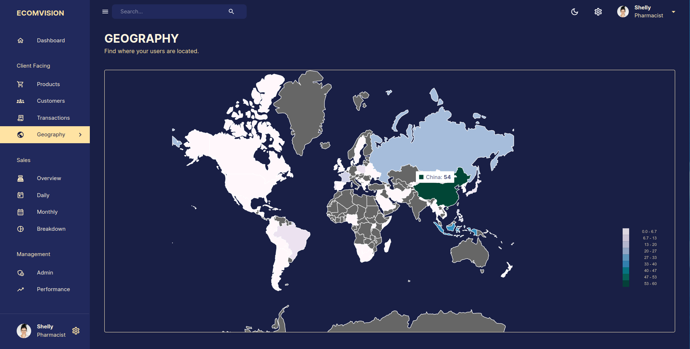
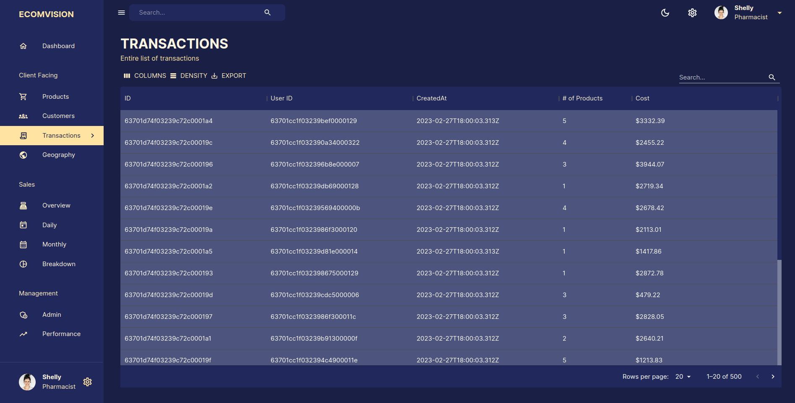
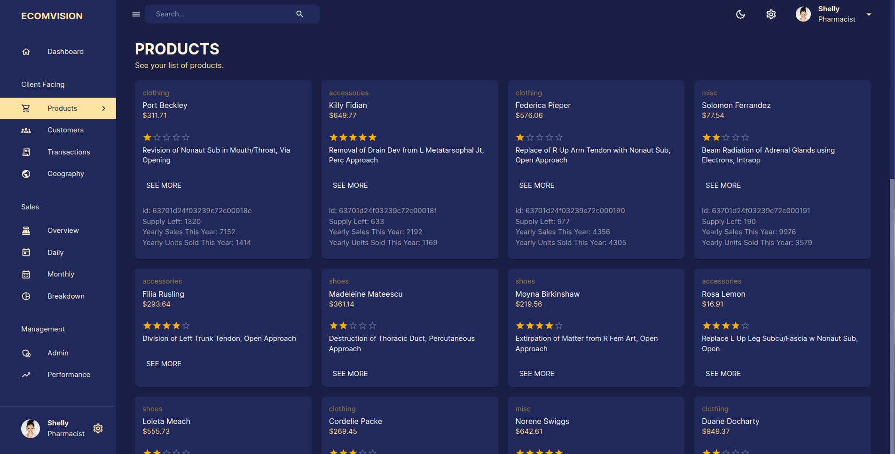

# BUSINESS ANALYTICS DASHBOARD APP

## Features

⚡️ React\
⚡️ Redux Toolkit\
⚡️ RTK Query\
⚡️ MUI\
⚡️ Nivo Charts\
⚡ Vite

## Description

This dashboard app is built with React, Express, MongoDB, and Node is a web-based application that allows users to monitor and manage various aspects of their business or organization. It provides a user-friendly interface that enables users to view and analyze real-time data, create and track tasks and projects, and access key information and resources from a single, central location. The app is built using a modern stack of technologies that ensures fast and a really efficient performance.

## Running the app

### .env

Create `.env` file based on `.env.template`

### Install deps and run the app

```bash
# install pnpm
npm i -g pnpm

```

```bash
# install dependencies
npm i

# run the backend

# run in dev mode on port 5173
npm run dev

# run tests
npm i run test
```

## View demo

[Demo](https://ecomvision-reacmuijs-alx.netlify.app)

## Backend

[GitHub](https://github.com/AlexMartin998/admin-dashboard-mui-api)

### Screenshots




| | | 
|:-------------------------:|:-------------------------:|
|     |   
|     |   